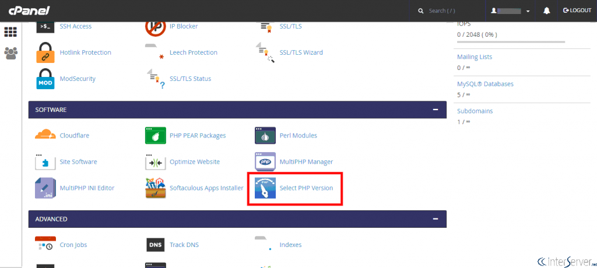
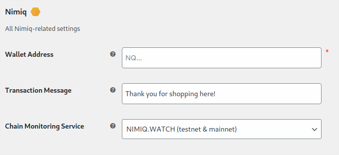
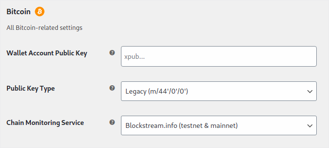
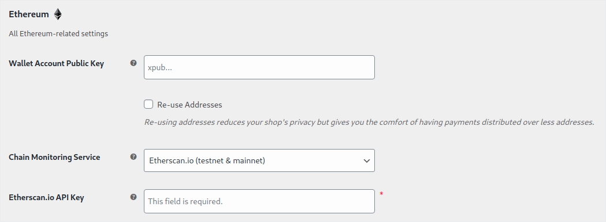
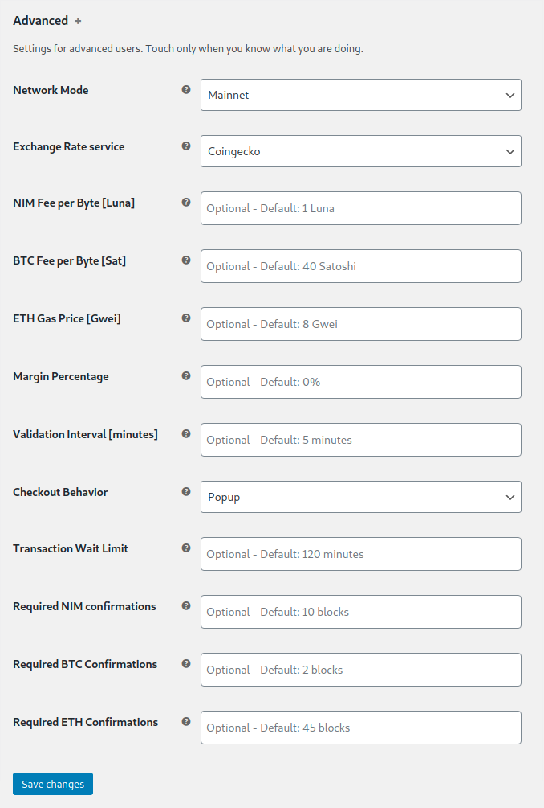

# How to install the Nimiq Payment Plugin for WordPress WooCommerce

WooCommerce is one of the most common online shop systems used on the Web.
Integrated into WordPress, it allows you to quickly set up your own online shop.

_TL;DR? Check out the [Nimiq Shop](https://shop.nimiq.com/) to see the plugin in action._

To get started, you need a WordPress installation somewhere.
If you use a managed service, your provider will have sent you all the details on where you find the login.
If instead you start from scratch with your own server somewhere, then please follow these instructions
[here first](wordpress-woocommerce-installation) to get a WordPress and WooCommerce installation up and running.

The installation will be two steps:

1. [Adding the WooCommerce plugin to WordPress and configuring it](#woocommerce)
1. [Finally, adding the Nimiq plugin plus a quick setup](#nimiq-plugin)

## WooCommerce

Log into the the admin panel of your WordPress installation, usually at `<www.your-server-domain.com>/wp-admin/`,
select _Plugins_ ⇒ _Add New_ ⇒ search for "woocommerce" ⇒ and hit _Install Now_.

After the installation is completed, click _Activate_ and follow the setup process.
FYI, WooCommerce will suggest to install and sign-up for a lot of other third-party plugins.
Take your time and decide wisely. :)

During the process, disable able all other payment options.
A future version of the Nimiq Payment Plugin will work in combination with other payment methods.

## Nimiq Plugin

### Requirements

Before installing the plugin, we have to make sure all the requirements are met.

* PHP 7 or higher
* WooCommerce 3.5 or higher (can be checked in the _plugins_  of WordPress clickinh the "More Details" link on WooCommerce)
* PHP extension `php-gmp` or `php-bcmath` (GMP is faster!)
* PHP extension `php-mbstring` (usually availble by default)

Below are details on how to check the requirements.

#### Using cPanel

* **PHP 7:** Go to *Software* > *Select PHP Version* and pick "PHP 7"

* **Extensions:** Make sure you have `php-gmp` (or `php-bcmath`) and `php-mbstring` checked

#### Using the Terminal

_Note:_ on Debian and Ubuntu you will use `apt` as shown in the examples below, on RedHat, Fedora, and Arch use `dnf` instead of `apt`.

With Docker:

* Type `docker exec`, press [tab] to find your docker WordPress container, press enter to get into the docker container
* **PHP 7:** run `php --version`, it should show a version of 7 or higher; If it instead returns "not found", then run `sudo apt -y install php php-cli php-fpm php-mysqlnd php-zip php-devel php-gd php-mcrypt php-mbstring php-curl php-xml php-pear php-bcmath php-json php-gmp`
* **Extensions:** run `php -m`, in the returned list, search if you can find `php-gmp` (or `php-bcmath`) and `php-mbstring`, if not install the   missing extensions by running `apt install -y libgmp10` and then `docker-php-ext-install gmp` and `docker-php-ext-install  mbstring`

Custom Installations:

* **PHP 7:** run `php --version`, it should show a version of 7 or higher; If it instead returns "not found", then run `sudo apt -y install php  php-cli php-fpm php-mysqlnd php-zip php-devel php-gd php-mcrypt php-mbstring php-curl php-xml php-pear php-bcmath php-json php-gmp`
* **Extensions:** run `php -m`, in the returned list, search if you can find `php-gmp` (or `php-bcmath`) and `php-mbstring`, if not install the   missing extensions by running `apt install -y php-gmp php-mbstring`

If you're not sure, please contact your service provider and ask for support.

### Installation

After checking the requirements, you can install the Nimiq Payment Plugin by searching for "nimiq" in the same place where you found the WooCommerce plugin before.

After installing it, click _Activate_.

You'll now find the _Nimiq Checkout for WooCommerce_ in the list of installed plugins.
Click _Configure_.

### Configuration

Let's have a look at most important settings and fields.

Customize your shop:

**Logo:** Upload an image to your WordPress installation first and then copy the link and insert it here. It is not possible to load it from some other website (same domain required).

#### Nimiq

**Wallet Address:** Enter the Nimiq Address to receive your NIM payments.

You can change the **message** your customers will see in the message field of the transaction. If you don't know any of the choices in the **Chain Monitoring Service** field just leave it with "NIMIQ.WATCH" - if you chose another service, make sure to sign-up and provide the credentials here.

#### Bitcoin

Setting up Bitcoin is optional. Leave fields empty to disable Bitcoin payments.

**Wallet Account Public Key**:  Copy paste your xPub or "Master Public Key" from your Bitcoin wallet software here. Also, make sure you have SSL/HTTPS enabled to accept payments in BTC.

_Note:_ In some wallet apps, the key is called "Account Public Key", "Master Public Key", or "Public Key" - same for Ethereum.

**Public Key Type:** Most of the times you don't have to chnage this. But there are wallets such as Coinomi that will show a field called "Derivation" or "BIP32" that looks similar to the values in the select box, in that case, pick the value that matches the one shown in your wallet.

#### Ethereum

Again, leave the fields empty if you don't want to accept Ethereum.

**Wallet Account Public Key:** Copy paste your xPub or "Master Public Key" from your Etherium wallet software here. We recommend to check the **Re-use ETH addresses** - otherwise, each order will be paid to a new ETH address - which means more privacy - but you as the shop owner will have to pull all the funds together later resulting in more fees and effort.

Additionally, you need to set the **Etherscan.io API key** which you can get at [etherscan.io](http://etherscan.io).
Similarily to Bitcoin, make sure you have SSL/HTTPS enabled.

#### Advanced

These settings are considered for experienced users only. Don't touch unless you know what you're doing. :)

A few of the options are:

**Network Mode:** For testing, your can set it to "Testnet" - which will require you to use Testnet currency, e.g. Testnet NIM - default is "Mainnet" for accepting NIM, BTC, and ETH.

**Exchange Rate Source:** If you select "Fastspot", then you do not have to enter recommended fees at the bottom, Fastspot will do that for you.

**Fees**: Keep  default values to make sure your transactions arrive timely. Increase values to push them to be even faster or lower to save on fees. If the value is too low, transactions might not arrive.

**Margin Percentage:** You can set this to a positive number, e.g. to compensate for volatility, or to a negative number to give a discount to crypto users. We recommend leaving it at "0". You should check your local legistlation before changing it.

**Validation Interval:** How often (in minutes) the blockchain should be checked if transactions have been confirmed. You can reduce this value if you need fast confirmations. Note, when changing the interval, the plugin needs to be disabled and re-enabled again.

**Checkout Behaviour:** Change this if you want to use top-level redirection instead of opening a pop-up, make sure that you have SSL encryption enabled (HTTPS in your address bar).

**Confirmations:** If the goods you're selling should be delivered as fast as possible and are, for example, not too expensive, then you can reduce the _Confirmations_ for NIM, BTC, and ETH - but not below 1. If in doubt, leave as is.

---

If you have doubts or something does not work as expected, check the tool tips on the left of each input box for help.

**Finally**, go to _WooCommerce_ ⇒ _Settings_ ⇒ _General_ and select US Dollars or Euros from _Currency_ at the bottom of the page. Selecting "Nimiq (NIM)" will work if you accept NIM only.

**🎉 Happy selling in NIM, BTC, and ETH! 🎉**

---

**Disclaimer**: please check the legal and tax requirements of your country before starting to sell with your shop.
